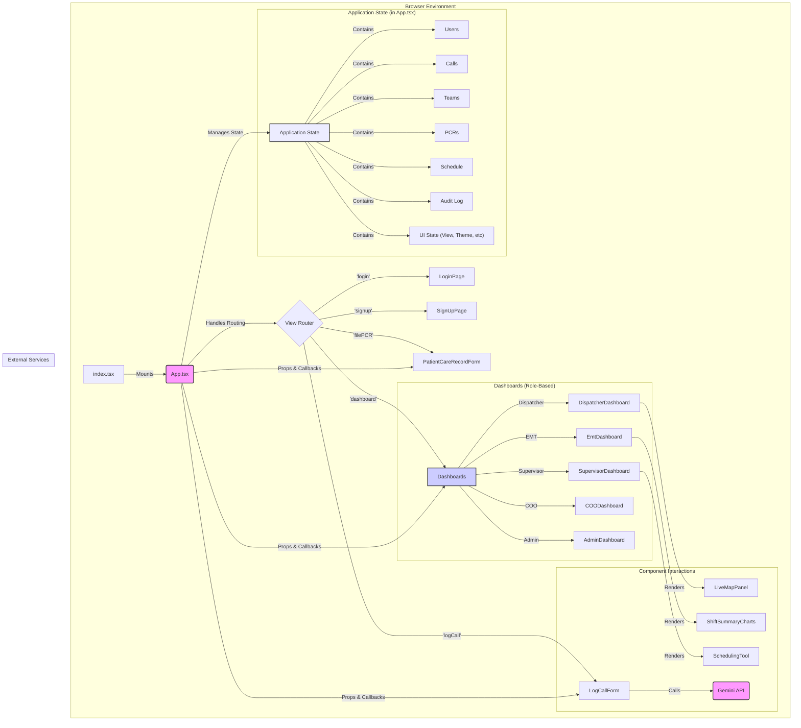
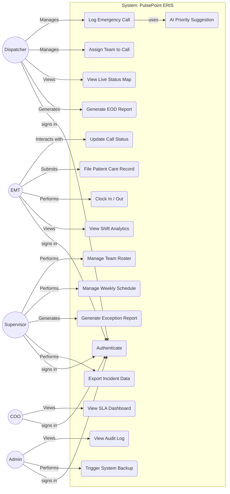

# PulsePoint ERIS - Detailed Technical Documentation

This document provides a comprehensive technical overview of the PulsePoint ERIS application, intended for developers, system architects, and technical project managers. It covers system architecture, state management, component design, key workflows, and non-functional requirements.

---

## 1. System Architecture

PulsePoint ERIS is architected as a **client-side, single-page application (SPA)** built with React. It operates entirely in the browser, with application state managed centrally in the root `App.tsx` component. This design makes it highly portable and easy to deploy. In a production environment, it would connect to a dedicated backend via a REST or GraphQL API for data persistence, real-time updates (likely via WebSockets), and business logic execution.

### 1.1. Technology Stack

-   **React (v19):** The core UI library for building the component-based interface.
-   **TypeScript:** Provides static typing for improved code quality, developer experience, and maintainability.
-   **Tailwind CSS:** A utility-first CSS framework used for rapid and consistent styling, including responsive design and dark mode.
-   **Chart.js:** A charting library used to render data visualizations in the EMT, Supervisor, and COO dashboards.
-   **@google/genai (Gemini API):** Integrated to provide AI-powered priority suggestions for new emergency calls based on their description.

### 1.2. Rendered Architecture Diagram

The following diagram illustrates the high-level architecture, component relationships, and data flow within the application. The `App.tsx` component acts as the central orchestrator.

### 1.3. Data Flow

The application follows a strict **unidirectional data flow** pattern:

1.  **State:** All application data (calls, teams, etc.) is held in the root `App.tsx` component using `React.useState`.
2.  **Props:** State is passed *down* to child components as read-only props. Components render themselves based on the props they receive.
3.  **Callbacks:** When a user interacts with a child component (e.g., clicks a button), the component invokes a callback function (e.g., `onAssignTeam`) that was also passed down as a prop from `App.tsx`.
4.  **State Update:** The callback function executes within `App.tsx`, updating the central state.
5.  **Re-render:** React detects the state change and re-renders `App.tsx` and any child components whose props have changed, ensuring the UI is always in sync with the state.

This pattern makes the application predictable and easier to debug, as state modifications are centralized and explicit.

## 2. Use-Case Diagram

This diagram outlines the primary actors and their interactions with the PulsePoint ERIS system.

## 3. State Management

### 3.1. Philosophy

State is managed centrally within the `App.tsx` component using `React.useState`. This approach was chosen for its simplicity and is highly effective for an application of this scale. It avoids the boilerplate of more complex state management libraries like Redux while maintaining a clear and predictable data flow.

### 3.2. Core State Slices

-   `users: User[]`: Stores all user objects. Used for authentication and team member assignment.
-   `calls: EmergencyCall[]`: The master list of all incidents. This is the most frequently updated piece of state.
-   `teams: Team[]`: Stores all response teams, their members, grade, base station, and current status.
-   `pcrs: PatientCareRecord[]`: A collection of all submitted Patient Care Records, linked by `callId`.
-   `schedule: Schedule`: A data structure representing the weekly shift assignments for all teams.
-   `auditLog: AuditLogEntry[]`: A chronological log of significant user actions for administrative review.
-   `loggedInUser: User | null`: The object of the currently authenticated user, which determines their role and permissions.
-   `view: AppView`: A string that controls which primary component or "page" is rendered (e.g., 'login', 'dashboard', 'logCall').
-   `isDarkMode: boolean`: A boolean flag that controls the application's light/dark theme.
-   `callToEdit: EmergencyCall | null`: Temporarily stores the call object for which a PCR is being filed.
-   `confirmationMessage: string`: Stores the message to be displayed on the confirmation page.

## 4. Component Deep Dive

### `App.tsx`
The root component and central nervous system of the application. It is responsible for:
-   Initializing and managing all application state.
-   Containing all state-mutating logic (e.g., `handleLogCallSubmit`, `handleUpdateTeamStatus`).
-   Containing the audit logging function `logAuditEvent`.
-   Passing state and callback functions down to child components as props.
-   Rendering the correct view or dashboard based on the `view` and `loggedInUser` state.

### Role-Based Dashboards
-   **`DispatcherDashboard.tsx`**: A feature-rich interface displaying pending incidents, available teams, and the `LiveMapPanel`. It uses `React.useMemo` to efficiently filter and sort calls. It also provides entry points for logging new calls and generating an EOD report.
-   **`EmtDashboard.tsx`**: A streamlined view focused on the EMT's single active assignment. It features clear action buttons to update their status throughout the call lifecycle and includes the `ShiftSummaryCharts` component.
-   **`SupervisorDashboard.tsx`**: An operational overview dashboard with KPI cards, a filterable team roster, and access to the `SchedulingTool` and `ExceptionReportModal`.
-   **`COODashboard.tsx`**: An executive-level dashboard focused on analytics. It calculates and displays Service Level Agreement (SLA) metrics and visualizes compliance.
-   **`AdminDashboard.tsx`**: A simple interface for viewing the immutable `auditLog` and performing system-level actions.

### Key UI & Logic Components
-   **`LiveMapPanel.tsx`**: A simulation of a real-time map. It uses `React.useState` and `useEffect` with a `setInterval` to manage the positions of team and incident icons. The logic moves dispatched teams towards their target and makes available teams "patrol" randomly.
-   **`LogCallForm.tsx`**: A controlled form for entering new incident details. It features a debounced `useEffect` hook to call the Gemini API for priority suggestions.
-   **`SchedulingTool.tsx`**: A modal overlay with a table-based UI for assigning teams to weekly shifts. It manages its own local copy of the schedule state until the user saves, preventing re-renders of the entire app on each change.
-   **`EODReportModal.tsx` & `ExceptionReportModal.tsx`**: These components receive data as props and use `React.useMemo` to calculate and display summary statistics for their respective reports.

## 5. Key Workflows & Business Logic

### 5.1. AI-Powered Priority Suggestion
-   **Trigger**: The `LogCallForm` component observes changes to the `description` text area.
-   **Debounce**: To avoid excessive API calls, a `setTimeout` function creates a 1-second delay. If the user continues typing, the previous timeout is cleared.
-   **API Call**: Once the user pauses, an asynchronous call is made to the Gemini API (`gemini-2.5-flash` model).
-   **Prompt Engineering**: The prompt provides the model with clear context and instructions to classify the description into one of four priority levels and to respond with only a single digit.
-   **State Update**: The response is parsed, and if valid, the form's `priority` state is updated, changing the selection in the dropdown menu. The dispatcher can still override this suggestion manually.

### 5.2. Team & Schedule Management
-   A supervisor can edit a team's roster via a modal. The `handleUpdateTeam` function in `App.tsx` receives the entire updated team object. It then updates the `teams` state and also iterates through the `users` state to update the `teamId` for any members who were added or removed.
-   The weekly schedule is managed similarly. The `SchedulingTool` works on a local copy of the schedule. When saved, the entire updated schedule object is passed to `handleUpdateSchedule` in `App.tsx`, which replaces the old schedule in the main state.

### 5.3. Analytics & Reporting
-   All analytics are calculated on the client-side using `React.useMemo` for efficiency.
-   **COO Dashboard:** The `slaStats` calculation filters for completed calls with all necessary timestamps, then iterates through them to calculate averages and the percentage of calls that fall within the defined `SLAMinutes`.
-   **EOD Report:** The `reportStats` calculation filters calls for the current day and then computes totals and averages.
-   This client-side approach is suitable for a demo but would be moved to a backend service in a production environment for performance and scalability.

### 5.4. Auditing
-   The `logAuditEvent` function in `App.tsx` is a centralized utility for recording actions.
-   It is called from within other state-updating functions (e.g., `handleLogin`, `handleAssignTeam`).
-   It constructs a new log entry with a timestamp, the current user's name, and the action details, then prepends it to the `auditLog` state array, ensuring the log is always displayed in reverse chronological order.

## 6. Non-Functional Requirements

-   **Performance**: `React.useMemo` is used extensively in dashboards to memoize filtered and sorted lists, preventing costly re-calculations on every render. The `LiveMapPanel` simulation is managed by a single `setInterval` to avoid performance issues.
-   **Accessibility (A11y)**: The application incorporates semantic HTML elements, ARIA roles (e.g., `role="alert"`), `htmlFor` attributes in labels, and ensures interactive elements are keyboard-focusable.
-   **Responsiveness**: Tailwind CSS's mobile-first utility classes are used to ensure the layout adapts seamlessly from large desktop monitors to mobile devices.
-   **Security**: As a frontend-only application, security is limited. In a production environment, this would be expanded to include:
    -   **Authentication**: Using JWTs (JSON Web Tokens) exchanged with a secure backend.
    -   **Authorization**: The backend would enforce role-based access control, not just the client.
    -   **Transport Security**: All API communication would be over HTTPS.
    -   **Input Sanitization**: Backend validation would be the source of truth to prevent injection attacks.

## 7. Conclusion & Future Work

PulsePoint ERIS currently stands as a high-fidelity, feature-complete prototype that demonstrates the core workflows of a modern Emergency Response Information System. Its robust, role-based architecture and clean, responsive UI successfully meet the initial design goals, showcasing the power of a modern frontend stack combined with AI integration.

The current implementation, while fully interactive, operates on local, ephemeral state. The logical next phase is to evolve the application into a production-ready, multi-user system. The roadmap includes:

1.  **Backend Integration:** Develop a robust backend service (e.g., using Node.js, Python, or Go) to manage a persistent database (e.g., PostgreSQL). This will be the source of truth for all application data.
2.  **Real-Time Communication:** Replace the `setInterval` map simulation with a real-time solution using WebSockets. This will allow for instantaneous updates across all connected clients when a call is logged, a team's status changes, or a unit's location is updated.
3.  **Authentication & Security:** Implement a secure authentication system using JWTs. The backend will enforce all business logic and role-based permissions, ensuring data integrity and security.
4.  **Scalability & Deployment:** Containerize the application using Docker for consistent, scalable deployments on cloud platforms.

With this solid foundation, PulsePoint ERIS is well-positioned for future expansion into more advanced areas such as predictive analytics for call volume, resource allocation optimization, and dedicated mobile applications for field personnel.