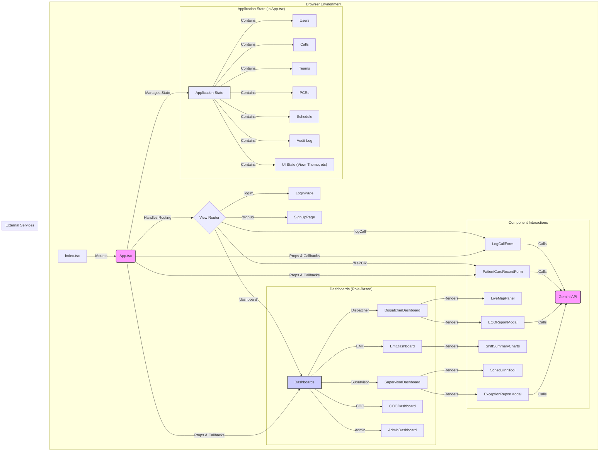
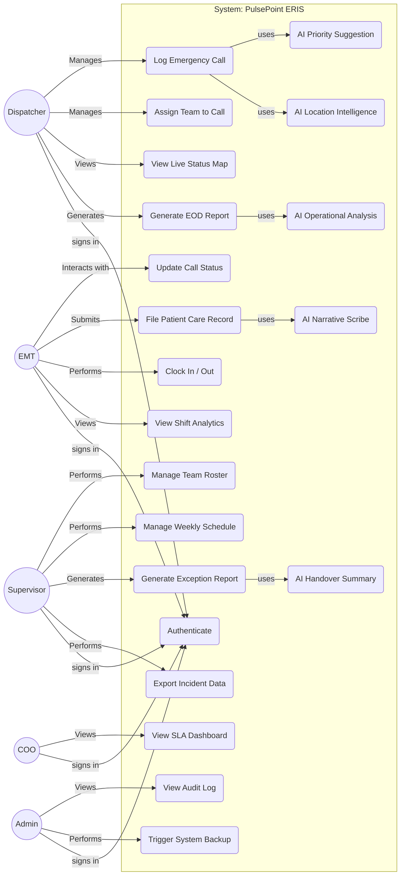

# PulsePoint ERIS - Detailed Technical Documentation

This document provides a comprehensive technical overview of the PulsePoint ERIS application, intended for developers, system architects, and technical project managers. It covers system architecture, state management, component design, key workflows, and non-functional requirements.

---

## 1. System Architecture

PulsePoint ERIS is architected as a **client-side, single-page application (SPA)** built with React. It operates entirely in the browser, with application state managed centrally in the root `App.tsx` component. This design makes it highly portable and easy to deploy. In a production environment, it would connect to a dedicated backend via a REST or GraphQL API for data persistence, real-time updates (likely via WebSockets), and business logic execution.

### 1.1. Technology Stack

-   **React (v19):** The core UI library for building the component-based interface.
-   **TypeScript:** Provides static typing for improved code quality, developer experience, and maintainability.
-   **Tailwind CSS:** A utility-first CSS framework used for rapid and consistent styling, including responsive design and dark mode.
-   **Chart.js:** A charting library used to render data visualizations in the EMT, Supervisor, and COO dashboards.
-   **@google/genai (Gemini API):** Integrated to provide a suite of AI-powered features:
    -   **`gemini-2.5-flash`:** For fast, general-purpose tasks like initial call priority suggestion and generating shift handover summaries.
    -   **`gemini-2.5-flash` with Google Maps Grounding:** To provide real-world, up-to-date geographical context for incident locations.
    -   **`gemini-2.5-flash-lite`:** For extremely low-latency tasks, such as the real-time AI Scribe for EMTs.
    -   **`gemini-2.5-pro`:** For more complex reasoning and analytical tasks, such as generating qualitative insights for the End of Day report.

### 1.2. Rendered Architecture Diagram

The following diagram illustrates the high-level architecture, component relationships, and data flow within the application. The `App.tsx` component acts as the central orchestrator.



### 1.3. Data Flow

The application follows a strict **unidirectional data flow** pattern:

1.  **State:** All application data (calls, teams, etc.) is held in the root `App.tsx` component using `React.useState`.
2.  **Props:** State is passed *down* to child components as read-only props. Components render themselves based on the props they receive.
3.  **Callbacks:** When a user interacts with a child component (e.g., clicks a button), the component invokes a callback function (e.g., `onAssignTeam`) that was also passed down as a prop from `App.tsx`.
4.  **State Update:** The callback function executes within `App.tsx`, updating the central state.
5.  **Re-render:** React detects the state change and re-renders `App.tsx` and any child components whose props have changed, ensuring the UI is always in sync with the state.

This pattern makes the application predictable and easier to debug, as state modifications are centralized and explicit.

## 2. Use-Case Diagram

This diagram outlines the primary actors and their interactions with the PulsePoint ERIS system.



## 3. State Management

### 3.1. Philosophy

State is managed centrally within the `App.tsx` component using `React.useState`. This approach was chosen for its simplicity and is highly effective for an application of this scale. It avoids the boilerplate of more complex state management libraries like Redux while maintaining a clear and predictable data flow.

### 3.2. Core State Slices

-   `users: User[]`: Stores all user objects. Used for authentication and team member assignment.
-   `calls: EmergencyCall[]`: The master list of all incidents. This is the most frequently updated piece of state.
-   `teams: Team[]`: Stores all response teams, their members, grade, base station, and current status.
-   `pcrs: PatientCareRecord[]`: A collection of all submitted Patient Care Records, linked by `callId`.
-   `schedule: Schedule`: A data structure representing the weekly shift assignments for all teams.
-   `auditLog: AuditLogEntry[]`: A chronological log of significant user actions for administrative review.
-   `loggedInUser: User | null`: The object of the currently authenticated user, which determines their role and permissions.
-   `view: AppView`: A string that controls which primary component or "page" is rendered (e.g., 'login', 'dashboard', 'logCall').
-   `isDarkMode: boolean`: A boolean flag that controls the application's light/dark theme.
-   `callToEdit: EmergencyCall | null`: Temporarily stores the call object for which a PCR is being filed.
-   `confirmationMessage: string`: Stores the message to be displayed on the confirmation page.

## 4. Component Deep Dive

### `App.tsx`
The root component and central nervous system of the application. It is responsible for:
-   Initializing and managing all application state.
-   Containing all state-mutating logic (e.g., `handleLogCallSubmit`, `handleUpdateTeamStatus`).
-   Containing the audit logging function `logAuditEvent`.
-   Passing state and callback functions down to child components as props.
-   Rendering the correct view or dashboard based on the `view` and `loggedInUser` state.

### Role-Based Dashboards
-   **`DispatcherDashboard.tsx`**: A feature-rich interface displaying pending incidents, available teams, and the `LiveMapPanel`. It provides entry points for logging new calls and generating an `EODReportModal`.
-   **`EmtDashboard.tsx`**: A streamlined view focused on the EMT's active assignment. It features clear action buttons and access to the `PatientCareRecordForm` which contains the AI Scribe.
-   **`SupervisorDashboard.tsx`**: An operational overview with KPI cards, a filterable team roster, and access to the `SchedulingTool` and `ExceptionReportModal`.
-   **`COODashboard.tsx`**: An executive-level dashboard focused on Service Level Agreement (SLA) analytics.
-   **`AdminDashboard.tsx`**: A simple interface for viewing the immutable `auditLog`.

### Key UI & Logic Components
-   **`LogCallForm.tsx`**: A controlled form for entering new incident details. It integrates two Gemini features: a debounced `useEffect` hook for priority suggestions and an on-demand function for location intelligence using Maps Grounding.
-   **`PatientCareRecordForm.tsx`**: A form for EMTs to file reports. It includes an "AI Scribe" feature that calls the `gemini-2.5-flash-lite` model to generate a narrative from raw notes.
-   **`EODReportModal.tsx` & `ExceptionReportModal.tsx`**: These components display summary statistics and include buttons that trigger Gemini API calls (`gemini-2.5-pro` for deep analysis, `gemini-2.5-flash` for summarization) to provide qualitative insights.
-   **`LiveMapPanel.tsx`**: A simulation of a real-time map using `useEffect` with a `setInterval` to manage the positions of team and incident icons.
-   **`SchedulingTool.tsx`**: A modal overlay for assigning teams to weekly shifts. It manages its own local copy of the schedule state to prevent re-renders on each change.

## 5. Key Workflow Diagrams

### 5.1. AI-Assisted Call Logging – Dispatcher Flow

This diagram illustrates the step-by-step process a dispatcher follows to log a new call, highlighting the interaction with the AI-powered system components.

```mermaid
activityDiagram
    title "AI-Assisted Call Logging – Dispatcher Flow"
    
    |Dispatcher|
    start
    :Incoming emergency call received;
    :Click 'Log New Call';
    :Enter caller info and incident description;
    if (All required fields filled?) then (Yes)
        |System|
        :Invoke Gemini model for priority suggestion;
        :Display suggested priority to dispatcher;
        |Dispatcher|
        if (Accept AI suggestion?) then (Yes)
            'Continue';
        else (No)
            :Manually choose priority;
        endif
        |System|
        :Check duplicates in CallDB;
        if (Duplicate Found?) then (Yes)
            :Prompt link to existing record;
            note right: Linked
            end
        else (No)
            :Save new call record and show confirmation;
            note right: Call logged successfully
            end
        endif
    else (No)
        :Display validation error;
        -> Enter caller info and incident description;
    endif
```

## 6. Key Workflows & Business Logic

### 6.1. AI-Powered Workflows
The application integrates Gemini in four key areas to enhance user capabilities.

1.  **AI Priority Suggestion (`LogCallForm`)**
    -   **Trigger**: A `useEffect` hook observes changes to the `description` field.
    -   **Logic**: A 1-second debounce (`setTimeout`) prevents excessive API calls. The `gemini-2.5-flash` model is prompted with instructions to classify the description into a priority level from 1-4 and respond with a single digit.
    -   **Result**: The form's `priority` state is updated, which the dispatcher can override.

2.  **AI Location Intelligence (`LogCallForm`)**
    -   **Trigger**: User clicks the "Verify Location" button.
    -   **Logic**: The app requests the user's `navigator.geolocation`. An API call is made to `gemini-2.5-flash` with the `googleMaps` tool enabled, passing the address and optionally the user's coordinates. The prompt asks for access challenges and nearby hospitals.
    -   **Result**: The model's text response and any associated map links from the `groundingChunks` are displayed below the location input.

3.  **Low-Latency AI Scribe (`PatientCareRecordForm`)**
    -   **Trigger**: EMT clicks the "Generate with AI" button.
    -   **Logic**: The content from the Vitals, Treatments, Medications, and Notes fields is compiled into a single string. A prompt is sent to the `gemini-2.5-flash-lite` model, instructing it to act as an expert paramedic and convert the notes into a professional PCR narrative.
    -   **Result**: The generated text populates a read-only "AI Generated Narrative" text area, which the EMT can reference.

4.  **AI Analysis & Summarization (`EODReportModal`, `ExceptionReportModal`)**
    -   **Trigger**: User clicks the "Analyze" or "Generate AI Handover Summary" button.
    -   **Logic**: Relevant data (daily calls or open incidents) is summarized into a text block. This context is sent to the Gemini API with a role-specific prompt (e.g., "act as an EMS analyst" or "act as a shift supervisor").
    -   **Models**: `gemini-2.5-pro` is used for the EOD report for deeper analysis, while the faster `gemini-2.5-flash` is used for the handover summary.
    -   **Result**: The formatted text response is displayed in a designated area within the modal.

### 6.2. Team & Schedule Management
-   A supervisor can edit a team's roster via a modal. The `handleUpdateTeam` function in `App.tsx` receives the updated team object. It then updates the `teams` state and also iterates through the `users` state to update the `teamId` for any members who were added or removed, maintaining a single source of truth.
-   The weekly schedule is managed similarly. The `SchedulingTool` works on a local copy of the schedule. When saved, the entire updated schedule object is passed to `handleUpdateSchedule` in `App.tsx`, which replaces the old schedule in the main state.

### 6.3. Auditing
-   The `logAuditEvent` function in `App.tsx` is a centralized utility for recording actions. It is called from within other state-updating functions (e.g., `handleLogin`, `handleAssignTeam`). It constructs a new log entry and prepends it to the `auditLog` state array, ensuring the log is always displayed in reverse chronological order.

## 7. Non-Functional Requirements

-   **Performance**: `React.useMemo` is used extensively in dashboards to memoize filtered and sorted lists, preventing costly re-calculations on every render. The choice of specific Gemini models (e.g., `flash-lite` for the scribe) is a performance optimization for user experience.
-   **Accessibility (A11y)**: The application incorporates semantic HTML, ARIA roles, `htmlFor` attributes, and ensures interactive elements are keyboard-focusable.
-   **Responsiveness**: Tailwind CSS's mobile-first utility classes are used to ensure the layout adapts seamlessly from large desktop monitors to mobile devices.
-   **Security**: As a frontend-only application, security is limited. In a production environment, this would be expanded to include:
    -   **Authentication**: Using JWTs (JSON Web Tokens) exchanged with a secure backend.
    -   **Authorization**: The backend would enforce role-based access control, not just the client.
    -   **Transport Security**: All API communication would be over HTTPS.
    -   **Input Sanitization**: Backend validation would be the source of truth to prevent injection attacks.

## 8. Conclusion & Future Work

PulsePoint ERIS currently stands as a high-fidelity, feature-complete prototype that demonstrates the core workflows of a modern, AI-enhanced Emergency Response Information System. Its robust, role-based architecture and clean, responsive UI successfully meet the initial design goals.

The logical next phase is to evolve the application into a production-ready, multi-user system. The roadmap includes:

1.  **Backend Integration:** Develop a robust backend service (e.g., using Node.js, Python, or Go) to manage a persistent database (e.g., PostgreSQL).
2.  **Real-Time Communication:** Replace the `setInterval` map simulation with a real-time solution using WebSockets for instantaneous updates across all connected clients.
3.  **Authentication & Security:** Implement a secure authentication system using JWTs.
4.  **Scalability & Deployment:** Containerize the application using Docker for consistent, scalable deployments on cloud platforms.